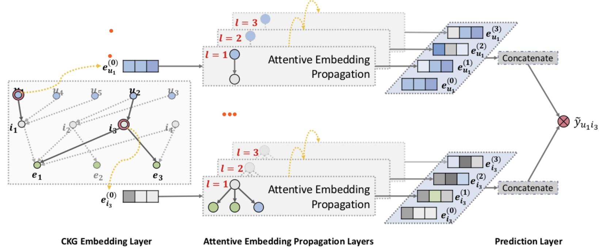
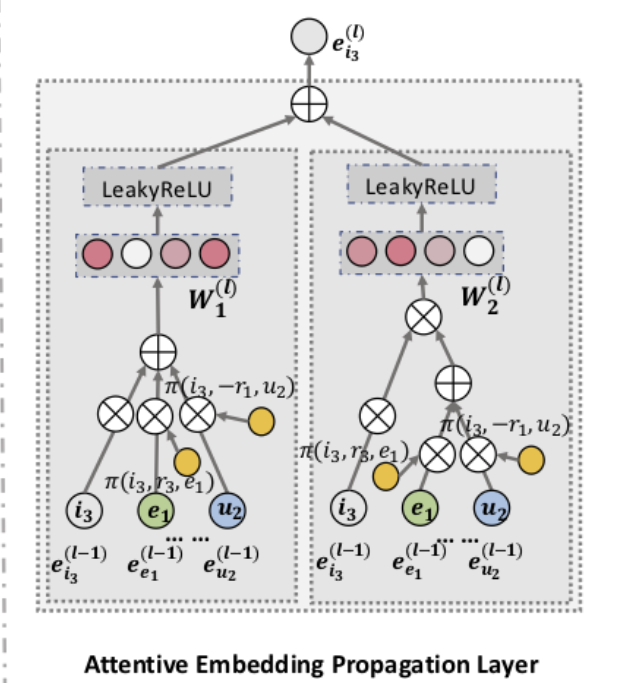

# 项目进度

## 4.9 - 4.14

### ~~阅读KGAT论文（图）~~

### 跟着李沐学ai

### 神经网络上手

本周用pytorch框架上手线性回归。线性回归是单层神经网络

#### 导入包

```python
import numpy as np
import torch
from torch.utils import data
from d2l import torch as d2l
from torch import nn
```

#### 构造数据迭代器

```
def load_array (data_arrays, batch_size, is_train=True):
    """构造pytorch迭代器"""
    dataset = data.TensorDataset(*data_arrays)
    return data.DataLoader(dataset, batch_size, shuffle=is_train)
```

函数首先创建了一个`TensorDataset`类，然后创建`DataLoader`的迭代器的类并返回。

- `TensorDataset`是 PyTorch 中表示由多个张量组成的数据集的类。
- `DataLoader`是 PyTorch 中提供用于批处理和在训练或评估过程中对数据进行洗牌的迭代器的类。


#### 数据及超参数定义

```python
true_w = torch.tensor([2, -3.4])
true_b = 4.2
features, labels = d2l.synthetic_data(true_w, true_b, 1000)

batch_size = 10
data_iter = load_array((features, labels), batch_size)
num_epochs = 3
```

​		`true_w`和`true_b`作为真实值传入`synthetic_data()`中构造特征（`features`）和标签（`labels`）。

- `features.shape() ` = (1000, 2)

- `labels.shape()` = (1000, 1) 

- `batch_size`表示每次处理的批量大小

- `data_iter`接受之前定义生成数据迭代器函数`load_array`的返回值。

- `num_epochs`:定义训练轮数

  

#### 构建神经网络

```python
net = nn.Sequential(nn.Linear(2, 1))
net[0].weight.data.normal_(0, 0.01)
net[0].bias.data.fill_(0)
loss = nn.MSELoss()			#直接调用nn中的MSELoss()作为损失函数
trainer = torch.optim.SGD(net.parameters(), lr=0.03)		#直接调用库中的SGD()随机梯度下降进行训练
```


线性回归模型比较简单， 但是为了统一神经网络构建方法， 这里还是把一层线性层放入`Sequential`容器中。对于`Sequential`容器，有以下实例代码

```python
import torch
from torch import nn

# 定义一个简单的 Sequential 模型
model = nn.Sequential(
    nn.Linear(10, 20),  # 全连接层，输入特征维度为10，输出特征维度为20
    nn.ReLU(),  # ReLU 激活函数
    nn.Linear(20, 30),  # 全连接层，输入特征维度为20，输出特征维度为30
    nn.ReLU()  # ReLU 激活函数
)
```

- 对于线性回归模型， 只有一层神经元，可以用`net[0]`对其进行操作。`net[0].weight.data.normal_(0, 0.01) ` `net[0].bias.data.fill_(0)`两句代码按照正态分布初始化线性层的`weight`, 并对该层的`bias`赋`0`

#### 训练

````python
for epoch in range(num_epochs) :
    for X, y in data_iter:
        l = loss(net(X), y)
        trainer.zero_grad()			#梯度清0，准备反向传播
        l.backward()						#对l进行反向传播， 计算模型参数梯度
        trainer.step()					#直接调用SGD的step()对模型进行更新
    l = loss(net(features), labels)
    print(f'epoch {epoch + 1}, loss {l:f}')
````

- 外层循环按照`num_epoches`控制训练轮数， 内层循环从数据迭代器中获取X, y， 
- `l`中保存计算出的预测值和实际值的损失


### 了解数据集结构和内容

#### 	1. MIND

- **数据集文件简介**

| 文件名                 | 描述                               |
| ---------------------- | ---------------------------------- |
| behaviors.tsv          | 用户的点击历史记录和映像日志       |
| news.tsv               | 新闻文章的信息                     |
| entity_embedding.vec   | 新闻中从知识图提取的实体的嵌入     |
| relation_embedding.vec | 从知识图提取的实体之间的关系的嵌入 |

- **behaviors.tsv**

  包含印象ID和用户新闻点击历史记录。每条数据`5`列， 用`Tab`分割。

  | 列名                                                         | 内容举例                        |
  | ------------------------------------------------------------ | ------------------------------- |
  | 印象ID（数据序号）                                           | 123                             |
  | 用户ID                                                       | U131                            |
  | 时间（年/月/日  上午/下午  时/分/秒）                        | 11/11/2019 9:05:58 AM           |
  | 历史记录（已点击新闻列表）                                   | N11 N21 N103                    |
  | impression（印象？）（显示新闻ID和用户行为， 1表示点击，0表示非点击） | N4-1 N34-1 N156-0 N207-0 N198-0 |

  

- **news.tsv**

  包含新闻文章详细信息。每条数据`7`列， 用`Tab`分割。

  | 列名     | 内容举例                                                     |
  | -------- | ------------------------------------------------------------ |
  | 新闻ID   | N37378                                                       |
  | 类别     | sports                                                       |
  | 子类别   | golf                                                         |
  | 标题     | PGA Tour winners                                             |
  | 摘要     | A gallery of recent winners on the PGA Tour.                 |
  | 新闻链接 | https://www.msn.com/en-us/sports/golf/pga-tour-winners/ss-AAjnQjj?ocid=chopendata |
  | 标题实体 | [{“Label”: “PGA Tour”, “Type”: “O”, “WikidataId”: “Q910409”, “Confidence”: 1.0, “OccurrenceOffsets”: [0], “SurfaceForms”: [“PGA Tour”]}] |
  | 摘要实体 | [{“Label”: “PGA Tour”, “Type”: “O”, “WikidataId”: “Q910409”, “Confidence”: 1.0, “OccurrenceOffsets”: [35], “SurfaceForms”: [“PGA Tour”]}] |

  新闻正文内容需要从链接内获取，微软提供[脚本](https://github.com/msnews/MIND/tree/master/crawler)

  实体key对应内容如下：

  | key               | 描述                               |
  | ----------------- | ---------------------------------- |
  | Label             | 维基知识图谱中实体名称             |
  | Type              | 维基数据中此实体的类型             |
  | WikidataId        | 维基数据中的实体ID                 |
  | Confidence        | 实体链接的置信度                   |
  | OccurrenceOffsets | 标题或摘要的文本中的字符级实体偏移 |
  | SurfaceForms      | 原文本中原始实体名称               |

  

- **entity_embedding.vec & relation_embedding.vec**

  包含使用了`TransE`方法从维基数据知识图谱中学习到的实体和关系100维嵌入。第一列是实体/关系的ID， 其他列是嵌入向量值。

  | ID        | embedding values                        |
  | --------- | --------------------------------------- |
  | Q42306013 | 0.014516 -0.106958 0.024590 … -0.080382 |

  

#### 	2. TOUTIAO 头条数据集

- **样例数据**

~~~
6552431613437805063_!_102_!_news_entertainment_!_谢娜为李浩菲澄清网络谣言，之后她的两个行为给自己加分_!_佟丽娅,网络谣言,快乐大本营,李浩菲,谢娜,观众们
~~~

每行一条数据，以`_!_`分割的各个字段，依次是 ___新闻ID___， ___分类编码___， ___分类名称___， ___新闻标题___， ___新闻关键词___。

- **分类编码和名称：**

  ```
  100 民生 故事 news_story
  101 文化 文化 news_culture
  102 娱乐 娱乐 news_entertainment
  103 体育 体育 news_sports
  104 财经 财经 news_finance
  106 房产 房产 news_house
  107 汽车 汽车 news_car
  108 教育 教育 news_edu 
  109 科技 科技 news_tech
  110 军事 军事 news_military
  112 旅游 旅游 news_travel
  113 国际 国际 news_world
  114 证券 股票 stock
  115 农业 三农 news_agriculture
  116 电竞 游戏 news_game
  ```

- **采集时间:**

  <u>2018年5月</u> 

#### 	3. [用户多种操作序列数据集](用户多种操作序列数据集)

​		该数据集较简单，对新闻内容没有详细数据描述，但有较多用户的操作数据，包括点击、完整阅读、评论、收藏、分享等。

| 文件名            | 描述                       |
| ----------------- | -------------------------- |
| candidate.txt     | 待推荐用户ID               |
| all_news_info.csv | 全量咨询内容               |
| news_info.csv     | 候选资讯内容               |
| train.csv         | 训练集（包含时间戳信息）   |
| test.csv          | 测试集（仅用户ID和新闻ID） |


#### 4. USA News Dataset

​		总体和MIND差不多，但体量小一些。包含两个文件：`news_text.csv`记录新闻的___ID___，___标题___，___摘要___，___类别___ ; `user_news_clicks.csv`记录___用户和对应新闻之间是否有点击关系（是或否对应1/0）___

[网页链接](https://www.kaggle.com/datasets/vinayakshanawad/us-news-dataset?select=news_text.csv)


####  [5.FakeNewsNet](https://github.com/KaiDMML/FakeNewsNet)

​	需要一系列操作来从twitter下载数据集， 数据集的获取比较复杂。其中看起来对我们最有用的一部分是数据集中的`news content.json`文件，文件中包含以下信息。

| 列名         | 描述                    |
| ------------ | ----------------------- |
| text         | 新闻主体内容            |
| images       | 新闻网页中的图片URL列表 |
| publish date | 新闻发布日期            |

<u>***数据集中的图片信息是否可以利用***</u>

#### 6. 新闻文本内容数据集合（阿里天池）

- [新闻文本分类数据集](https://tianchi.aliyun.com/dataset/86642?spm=5176.12282013.0.0.61d4121dlN3ZEy)

  数据集中包含`label`和`text`两列， 分别表示`新闻类别标签`和`文本内容`。

  ***对于`text`列下的内容还不太明白怎么使用***


#### 7. [THUCNews](http://thuctc.thunlp.org)

​	THUCNews是根据新浪新闻RSS订阅频道2005~2011年间的历史数据筛选过滤生成，包含74万篇新闻文档（2.19 GB），均为UTF-8纯文本格式。我们在原始新浪新闻分类体系的基础上，重新整合划分出14个候选分类类别：财经、彩票、房产、股票、家居、教育、科技、社会、时尚、时政、体育、星座、游戏、娱乐。使用THUCTC工具包在此数据集上进行评测，准确率可以达到88.6%。

​	数据集中包含大量中文新闻文本内容, 但是我们认为对于本项目的创新内容作用不大。

### ~~确定项目初期方案~~


## 4.16 - 4.21

### 阅读3篇论文

#### 1. KGAT

- **整体运作流程**

  

  在KGAT模型中主要分为3个层次：

  - `CKG`词向量嵌入层

    ​	KGAT模型把用户和实体的联系引入原始的知识图谱，构成了联合知识图谱collaborative knowledge graph(`CKG`)。在`CKG`中保存了用户和实体的联系，之后的所有操作都基于这张联合知识图谱。

    ​	在词向量嵌入层中使用的是`TransE`的方式，考虑真实和虚假三元组，表示图中的节点及关系的嵌入表示。

  - 多层注意力传播

    ​	KGAT模型最主要的是第二部分的注意力机制传播层。对`CKG embedding layer`产生的用户/实体向量进行学习，并且引入注意力机制，从而可以让模型分辨哪些特征是更重要的。每一个单层都包含三个部分：

    - 信息传播
    - 注意力机制
    - 信息聚合

    ​	这一部分的输出是一系列`L`个新的用户/实体向量，其中`L`是传播层数，这`L`个输出传给下一层继续模型流程。

  - 预测层

    ​	预测层接受从前面传来的`L`个向量表示，并且拼接成最终的e~u~^*^和e~i~^*^。最后对e~u~^*^和e~i~^*^做向量乘积得到最终预测值，表示用户与这个实体之间的匹配值。

- **单层注意力机制传播**

  

  - 信息传播

    ​	模型中把一个实体`h`的所有邻居实体都考虑在内，在图上可以看到最下面的一排彩色的实体向量，其中最左边的是要处理的向量，之后的所有向量（包括省略号省略的，应该包含中心实体所有的邻居实体）。如此的设计可以把知识图谱中周围的信息考虑在内，从而使模型更加精确。

    ​	因此定义N~h~为所有以`h`为头实体的三元组集合，并对此做向量表示，公式为：

    ​														$e_{\Nu_{h}}=\sum_{(h,r,t)\in\Nu_{h}} \pi(h,r,t)e_{t}$

    ​	N~h~的引入是对单独e~h~的补充，使得模型能够把更多信息考虑在内，达到更好的预测效果。

  - 注意力机制

    ​	这一部分主要定义了之前提到的$\pi(·)$。公式如下：

    ​												 $\pi(h,r,t)=(W_{r}e_{t})^\top tanh((W_{r}e_{h}+e_{r}))$

    ​	通过$\pi(·)$函数可以按照实体向量间的距离来决定在这一层的学习中传递多少信息，关系更近的实体会传递更多的信息。

    ​	随后在N~h~范围内对$\pi(·)$使用`softmax`做归一化。

    ​	上述操作可以把实体h的邻居节点信息全部考虑在内，并且是根据关系远近有差别的学习。

  - 信息聚合

    ​	最后一部分是把之前得到的中间结果最后聚合成这一层的输出$e_{i3}^{(l)}$.论文中列举了三种聚合器，其中`Bi-Interaction`的效果最好，在模型工作流程图中也给出了`Bi-Interaction`的原理图。`Bi-Interaction`的公式如下：											

    ​             	  $f_{Bi-Interaction}=LeakyReLU(W_{1}(e_{h}+e_{N_{h}}))+LeakyReLU(W_{2}(e_{h}\bigodot e_{N_{h}}))$

    

    - $W_1$和$W_2$是随着`L`层传播不断更新学习的矩阵。
    - $LeakyReLU(·)$是在简单$ReLU(·)$函数的基础上对负值不是简单的输出0，而是输出一个很小的梯度以保留更多信息。

    ​    图中左侧对应公式$LeakyReLU(W_{1}(e_{h}+e_{N_{h}}))$, 是把邻居实体向量做完一系列操作后直接与目标向量相加，之后通过不断学习更新的$W_1$作用得到一个向量表示，最后通过$LeakyReLU(·)$函数。

    ​	图中右侧对应公式$LeakyReLU(W_{2}(e_{h}\bigodot e_{N_{h}}))$, 是把邻居实体向量做完一系列操作后先加和在一起产生一个邻居特征向量，然后和目标向量做按元素相乘,之后通过$W_2$作用得到一个向量表示。

    ​	图中左右两边的结果向量最后相加得到这一层的输出，随后不断重复上述过程得到`L`个输出结果。

- **问题**

  

#### 2. KGIN

#### 3. 美团

### 确定项目初期方案